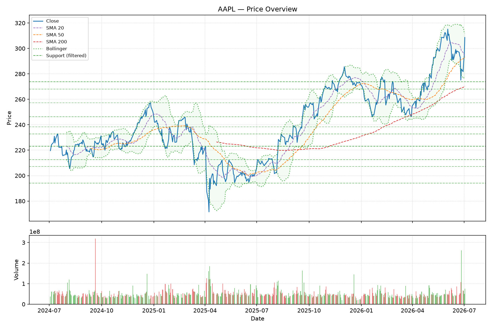
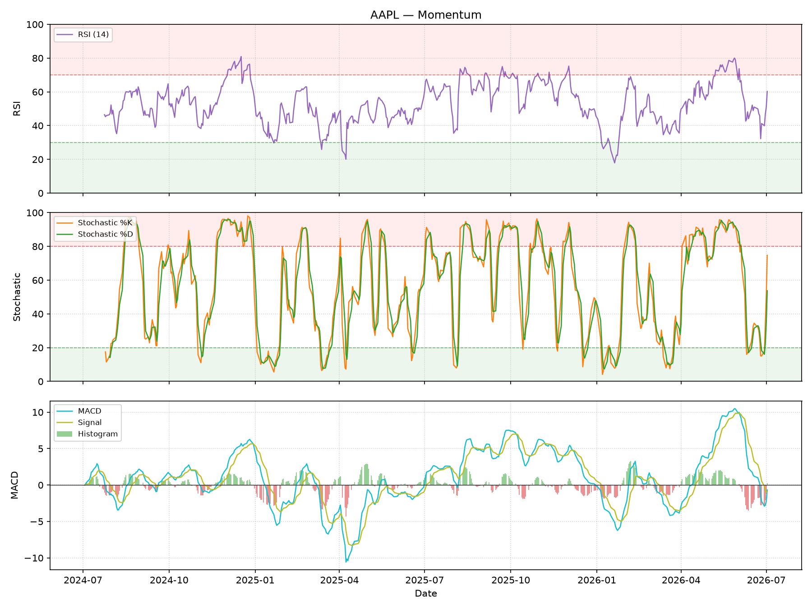
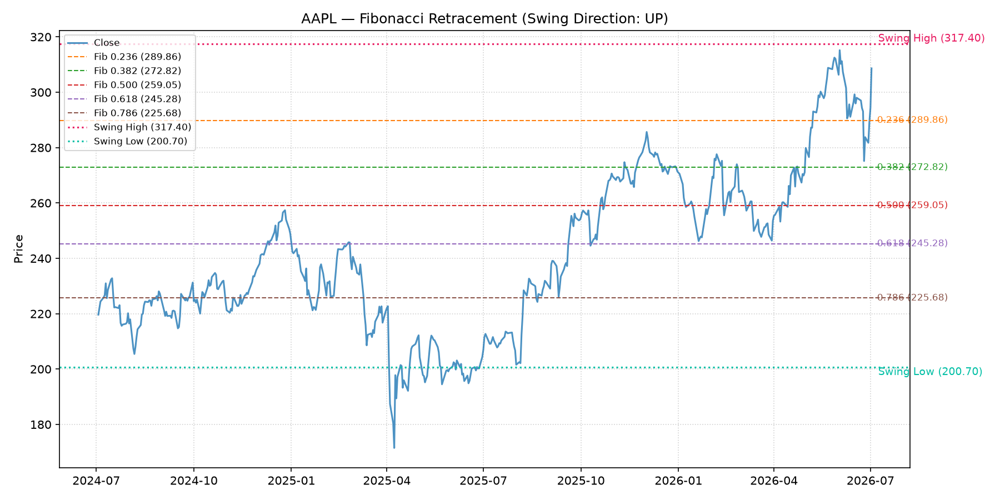
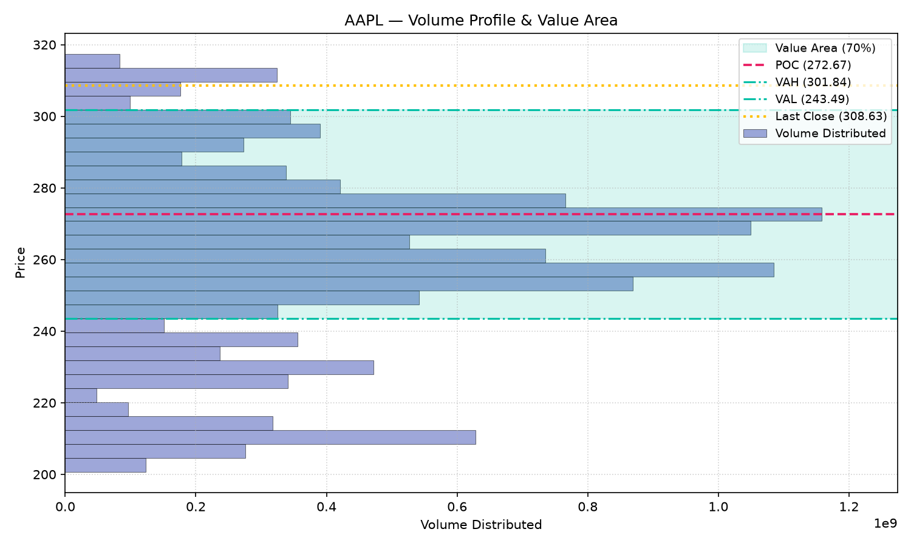

# Techna

A **deterministic technical-analysis agent** for stocks. Techna reports
indicator *states* (e.g. "RSI = 72, in the overbought zone"); it never says
"buy" or "sell" and gives no financial advice. Every number is computed by
verifiable Python and tested against frozen golden fixtures — the LLM never
estimates a value.

## Example output (real run, AAPL)

| Price overview (MAs, Bollinger, filtered levels) | Momentum (RSI, Stochastic, MACD) |
|---|---|
|  |  |

| Fibonacci retracement + empirical touch stats | Volume profile (POC / value area) |
|---|---|
|  |  |

**Every one of these charts — and 18 more — is also embedded directly inside a portable
Jupyter notebook** (`{TICKER}_report.ipynb`) that every run generates by default. GitHub renders
`.ipynb` files natively, so you can open the two pre-built proof notebooks right here without
downloading anything:

- **[notebooks/full_showcase.ipynb](notebooks/full_showcase.ipynb)** — one real end-to-end run
  (AAPL): terminal dashboard, all 22 charts, every module's plain-English finding, and a live
  pytest run, each chart preceded by the exact `report_builder.draw_*_chart` source that drew it.
- **[notebooks/proof_of_correctness.ipynb](notebooks/proof_of_correctness.ipynb)** — cross-checks
  Techna's RSI/MACD/Bollinger/ADX against the independent `ta` library and known-answer
  econometric tests (Hurst, ADF) on synthetic data.

## Non-negotiable principles

1. **No LLM-computed numbers.** Every value is produced by verifiable Python
   (pandas/numpy/scipy/statsmodels) and tested against frozen golden fixtures.
2. **Pure functions.** Each indicator is `compute_x(series, ...) -> result`
   with no I/O, so it is unit-testable in isolation.
3. **Signals, not advice.** States only — interpretation belongs to the human.
   Even the optional `--explain` briefing is rule-based and never advises.
4. **Offline-first, test-driven.** Tests run offline in seconds against
   hand-verifiable golden CSVs.
5. **Spec-driven.** Behavior is described in Gherkin under `specs/`.
6. **Human-in-the-loop gates** for long/expensive steps (`--no-interactive`
   to skip in CI).
7. **Slopsquatting defense.** Dependencies are verified to exist on PyPI and
   constrained to a curated allowlist before install.
8. **Consistent I/O contract.** Every run produces BOTH a markdown report and
   a structured `{TICKER}_result.json` aggregating each module's result dict.
9. **Provenance up front.** Every report/notebook opens with a "Data &
   Parameter Provenance" section stating exactly what input (source, date
   range, benchmark) and what fixed parameters (SMA/RSI/ADX/Donchian/... windows,
   read live from `techna/config.py`) produced every number below — nothing
   fitted or tuned per ticker.

## What it computes

Nineteen indicator modules, every value deterministic and golden-tested:

| Area | Module | Indicators |
|---|---|---|
| Events | `events` | "what changed today" — deterministic last-bar state-change detection |
| Trend | `trend` | SMA 20/50/200, EMA, golden/death cross, trend state |
| MTF | `mtf` | weekly-resampled trend/RSI/MACD/ADX + daily-weekly alignment |
| Momentum | `momentum` | RSI (Wilder), MACD, Slow Stochastic (14,3,3) |
| Volatility | `volatility` | Bollinger Bands (ddof=0) |
| Squeeze | `squeeze` | Bollinger-inside-Keltner volatility compression state |
| Levels | `levels` | support/resistance + significance clustering (v2) |
| Volume profile | `volume_profile` | price-by-volume histogram, POC, 70% value area (daily + weekly) |
| Fibonacci | `fibonacci` | 252-bar swing retracement levels + empirical touch base rates |
| Donchian | `donchian` | 20/55-day channels (prior-bar extremes, no look-ahead) + breakouts |
| Candles | `candles` | doji, hammer, shooting star, engulfing (context-slope gated) + base rates |
| Regime | `regime` | ATR, ADX/+DI/−DI, trend & volatility regime |
| Divergence | `divergence` | price vs RSI/MACD (confirmed swings, no look-ahead) |
| Base rates | `baserates` | conditional forward returns: RSI, Bollinger, Stochastic, Donchian55, engulfing |
| Relative | `relative` | relative strength vs a benchmark (default SPY) |
| Seasonality | `seasonality` | monthly-return heatmap & summary (partial months excluded) |
| Volume | `volume` | OBV (+divergence), VWAP, MFI(14), anchored VWAP (52w-low/high, YTD) |
| Econometrics | `econometrics` | ACF/PACF correlogram, fat-tails (skew/kurtosis/Jarque-Bera) |
| Risk context | `risk_context` | 52-week position, drawdown episodes, liquidity, beta |
| Scoring | `scoring` | 6 independent 0–100 dimension scores (no aggregate verdict) |

Plus an optional rule-based **Analyst Briefing** (`--explain`), a markdown
report with 22 charts (a "Today's Events" section leads the report), a
terminal dashboard (rich), and the JSON sidecar.

## Layout

```
techna.py            CLI orchestrator (argparse)
techna/
  config.py          paths, schema, all thresholds (no math)
  data_layer.py      single cached OHLCV source (fetch once, reuse)
  io_contract.py     result-dict contract + JSON sidecar writer
  security.py        dependency allowlist + PyPI existence check
  scoring.py         deterministic 6-dimension scores
  briefing.py        deterministic rule-based analyst briefing
  report_builder.py  markdown report + matplotlib charts + rich panels
  indicators/        the 14 indicator modules above
tools/               verify_deps.py, golden fixture generators, smoke_fetch.py
tests/               offline pytest suite + golden fixtures
specs/               Gherkin behavior specifications
```

## Setup

```bash
# 1. Security check — verify every dependency exists on PyPI (no install yet)
python tools/verify_deps.py

# 2. Install (global Python, or a venv)
python -m pip install -r requirements.txt
python -m pip install -r requirements-dev.txt   # ruff, mypy, vulture (optional)

# 3. Run the offline test suite
python -m pytest
```

## Usage

```bash
python techna.py AAPL                 # report + all 18 charts + result.json + notebook (all by default)
python techna.py THYAO.IS             # BIST works too
python techna.py AAPL --explain       # add the rule-based Analyst Briefing
python techna.py AAPL --no-chart      # skip PNG charts (also skips the notebook, which embeds them)
python techna.py AAPL --no-notebook   # skip the .ipynb, keep charts + report
python techna.py AAPL --benchmark QQQ # relative strength / beta vs a custom benchmark
python techna.py AAPL --no-interactive --out reports/   # CI-friendly
```

If `nbformat` isn't installed (see `requirements-notebook.txt`), the notebook step is skipped
with a friendly warning — the report and charts are unaffected either way.

Every run prints its data provenance (`Data: cache|network | N bars | first to last date`).
Cached data whose last bar is older than `CACHE_STALE_DAYS` (default 1) is auto-refreshed on
the real network path; if the refresh fails, the stale cache is served **with a warning**
instead of crashing — so an automated daily run always either gets fresh data or says loudly
that it didn't. Seasonality excludes the current partial month (a 3-trading-day July is not a
"monthly return"); pass nothing — it's automatic.

Outputs land in `reports/`: `{TICKER}_report.md`, the chart PNGs, a portable `{TICKER}_report.ipynb`, and the
machine-readable `{TICKER}_result.json`.

## Quality gates

```bash
python -m pytest          # 236 offline tests, deterministic, ~90s
python -m ruff check techna/ tools/ techna.py tests/
python -m mypy techna     # the package
python -m mypy techna.py  # the CLI entry (separate pass — shares the package name)
python -m pytest --cov=techna            # coverage (~93%; network paths excluded by design)
python -m pip_audit -r requirements.txt  # dependency CVE audit (needs network)
```

## Proof of correctness (notebooks)

Two complementary, self-contained notebooks (built once, real outputs baked in, no re-run
required to view):

- **`notebooks/proof_of_correctness.ipynb`** — DEPTH. Independently cross-checks Techna's
  RSI/MACD/Bollinger/ADX against the third-party `ta` library on a real ticker, walks through a
  hand-verified golden-fixture anchor, and runs known-answer econometric tests (Hurst exponent,
  ADF) on synthetic series with a fixed seed.
- **`notebooks/full_showcase.ipynb`** — BREADTH. One real end-to-end run of the full CLI on a
  real ticker: the terminal dashboard, all 17 generated charts, every module's plain-English
  `finding`, and a live pytest run — all embedded as *actually executed* output (base64 images,
  not relative file links), so it renders correctly even if shared as a single standalone file.
  Each chart is preceded by the exact `report_builder.draw_*_chart` source that drew it, fetched
  live with `inspect.getsource()` at build time — never hand-copied, so it can't silently drift
  from the real code.

Both are point-in-time demonstration artifacts; the pytest suite remains the authoritative,
continuously-enforced correctness gate. That gate includes `tests/test_chart_data_fidelity.py`:
for every `draw_*_chart` function, it inspects the actual matplotlib `Line2D`/`Bar`/`AxesImage`
objects on the rendered figure and asserts their data is numerically identical to the values
passed in — proving each chart plots exactly what was computed, not just that it runs without
crashing (this is a distinct claim from "the indicator math is correct", which the golden
fixtures and `proof_of_correctness.ipynb` already cover).

```bash
python -m pip install -r requirements-notebook.txt  # ta, nbformat, nbconvert, ipykernel
python tools/build_proof_notebook.py                # regenerates proof_of_correctness.ipynb
python tools/build_showcase_notebook.py             # regenerates full_showcase.ipynb
```

**Every `techna.py TICKER` run also generates a `{TICKER}_report.ipynb`** right next to the
report and PNGs (on by default; `--no-notebook` to skip it). It contains no executed code cells
(it never claims to have "run" anything — it only reformats the same JSON `finding` sentences
and PNGs that run already produced), but every chart is embedded as a base64 data URI, not a
relative file link — so the resulting notebook is self-contained and portable: it renders
correctly even if shared or moved as a single file, with no sibling PNGs required (verified by
copying the .ipynb alone to an empty folder and confirming all 22 charts still render).

Right after the title, both the notebook and the markdown report open with a **Data & Parameter
Provenance** section: the exact data source (cache/network/fixture), date range, bar count, and
benchmark ticker used, plus a table of every fixed parameter (SMA/RSI/MACD/ADX/Bollinger/Donchian/
Fibonacci/MFI/Stochastic/volume-profile windows and thresholds) — all read live via `getattr()`
from `techna/config.py`, so the table can never silently drift from the constants the run actually
used. It closes with an explicit note that none of these parameters are fitted or tuned per
ticker.

For every one of the 19 modules, the notebook also shows: the **raw metric values** as
pretty-printed JSON (not just the paraphrased `finding` sentence — e.g. the actual RS ratio,
beta (with its sample size `n`), Hurst exponent, ADF/KPSS statistics, best-seasonal-month return,
not only their English summary), the **live source of the `compute_*` indicator function(s)** that
produced those numbers (via `inspect.getsource()`, e.g. `techna.indicators.risk_context.compute_beta`),
and the **live source of the `report_builder.draw_*_chart` function** that drew the accompanying
chart. All of these are fetched fresh at report-generation time, never hand-copied, so none of
them can silently drift from the real running code — the goal being that a reader can verify
every number shown against the exact input, parameters, and code that produced it, without
needing a separate showcase notebook or trusting the prose alone.

## Status

**Phases 0–18 complete.** Data layer → 13 indicator modules → statistical
characterization (econometrics) → risk context (drawdown/beta/liquidity/52w) →
transparent independent scores → deterministic synthesis briefing. All offline,
golden-tested, and strictly descriptive — never advice.
